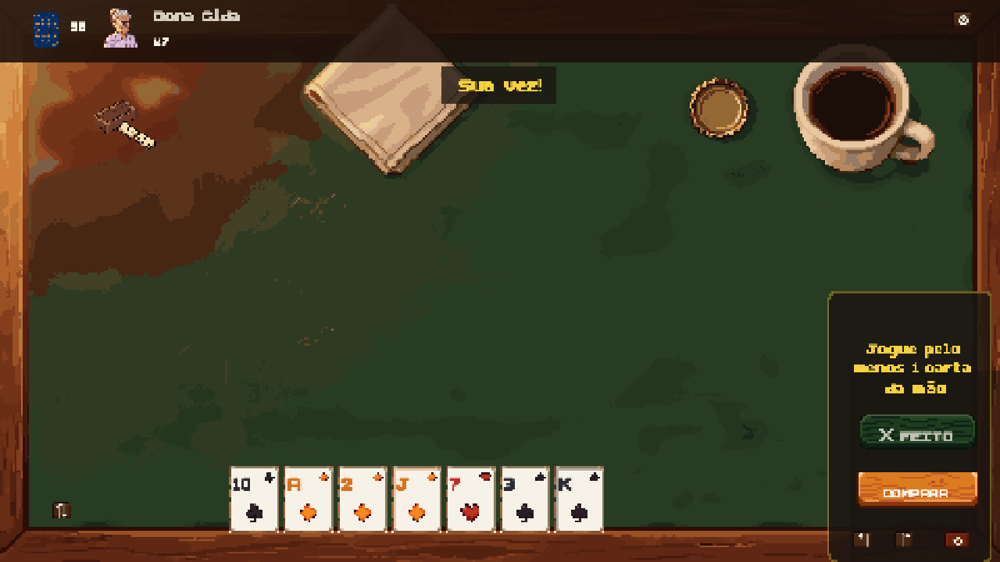

<div align="center">

# MEXEMEXE!

### *Arruma. Desarruma. Bate.*

A pixel-art digital card game based on Brazilian **Mexe-Mexe**, built with
Vite + TypeScript + Phaser.

[](https://github.com/mgummich/mexemexe-game/actions/workflows/ci.yml)
[](https://github.com/mgummich/mexemexe-game/actions/workflows/pages.yml)
[](LICENSE)

**[▶ Play in your browser](https://mgummich.github.io/mexemexe-game/)** ·
**[📚 Documentation](https://mgummich.github.io/mexemexe-game/docs/)** ·
**[🤝 Contributing](CONTRIBUTING.md)**



</div>

## Status

Playable and released (see [`CHANGELOG.md`](CHANGELOG.md) for the current
version). Local play against AI opponents, the tutorial, cosmetics and offline
play are finished features. **Online rooms are alpha** — labelled `ONLINE
(ALPHA)` in the game — and have real limitations, listed in
[`docs/MULTIPLAYER.md`](docs/MULTIPLAYER.md).

## The game in one minute

- 2–4 players, 7 cards each, **two 54-card decks = 108 cards, 4 jokers**. No
  discard pile.
- Build **runs** (3+ same suit, consecutive; ace low *or* high, no K-A-2 wrap)
  and **groups/trincas** (3 or 4 of a rank, natural suits never repeated).
  At most **one joker per meld**.
- **MEXE MODE**: on your turn the whole table is yours to break apart, move,
  split and rebuild. Temporary invalid states are fine while you edit.
- **FEITO** confirms, and only unlocks when every meld is valid, you added at
  least one card from your hand, and nothing left the table.
- No play? **COMPRAR** draws one card and ends your turn.
- Empty your hand first to win. If the draw pile runs out, fewest cards wins.

Authoritative ruleset, with worked examples:
**[`docs/GAME_RULES.md`](docs/GAME_RULES.md)**.

## Quick start

```bash
npm install
npm run dev        # dev server on :5173
npm run build      # production build into dist/
npm run preview    # serve the build on :4173
npm run server     # optional: WebSocket server for online rooms, on :8787
```

Portuguese UI by default; switch to English in the menu, the ⚙ settings
overlay, or with `?lang=en`.

Full setup, URL parameters, env vars and troubleshooting:
[`docs/DEVELOPMENT.md`](docs/DEVELOPMENT.md).

## Features

- **Local play**: 2–4 seats, hot-seat or against AI, with a setup screen for
  picking seats and opponent personalities.
- **Four AI opponents** — Dona Cida, Juninho, Bia and Seu Zé — across four
  difficulty tiers (Beginner / Casual / Smart / Expert), with a pace setting and
  optional move explanations. Personality picks the policy, difficulty picks how
  deep it searches; every tier is deterministic, budgeted, blind to hidden hands,
  and unable to confirm an illegal table.
- **Interactive tutorial**: 12 teach-by-doing steps over a scripted table,
  fully localized.
- **Three helper modes** (Beginner / Standard / Expert) control how much
  legality feedback is shown — never what a move is allowed to do.
- **Mobile**: portrait/landscape layouts, a full-screen tap-based Mexe editor,
  table zoom and a read-only meld focus view.
- **Cosmetics**: 4 table themes, 5 card backs, 9 avatars. Purely client-side.
- **Audio**: context-aware music (menu / mexe / game) plus procedural SFX, with
  separate volume sliders and a reduced-motion option.
- **Online turn timer**: Casual / Fast / Off presets chosen by the host in the
  lobby and frozen at match start, with a once-per-turn Mexe extension, a
  warning window, reconnect grace and a missed-turn limit. The server owns the
  clock end to end; the client only renders it.
- **Installable PWA** that works fully offline — see
  [`docs/PWA_OFFLINE.md`](docs/PWA_OFFLINE.md).
- **Online rooms (alpha)**: 2–4-player private rooms over WebSocket,
  server-authoritative — see [`docs/MULTIPLAYER.md`](docs/MULTIPLAYER.md).

## Controls

Mouse/touch: drag cards between hand and table, or tap to select and tap a
destination. Keyboard (human turn only): `Esc` pause · `Z` undo ·
`Shift+Z`/`Y` redo · `R` reset draft · `C` comprar · `F` feito · `S` sort hand
· `H` help.

Validity is never signalled by color alone: an invalid meld also carries a ✗
badge and a dashed stroke, and a disabled FEITO is prefixed with ✕. A +25%
large-text option lives in the settings overlay.

## Repo layout

```
src/            client (rules engine, scenes, UI, AI, net client)
server/         WebSocket server for online rooms
tests/          Vitest unit tests (incl. tests/server)
e2e*/           Playwright suites: screenshots, cross-browser, multiplayer, PWA
public/         static assets (art, audio, PWA manifest, service worker)
scripts/        asset/icon generation, verification gates, release tooling
docs/           documentation (see below); docs/archive holds historical audits
```

## Documentation

| Doc | What it covers |
|---|---|
| [`docs/GAME_RULES.md`](docs/GAME_RULES.md) | Source of truth for the implemented rules |
| [`docs/ARCHITECTURE.md`](docs/ARCHITECTURE.md) | Module map, data flow, where new code goes |
| [`docs/DEVELOPMENT.md`](docs/DEVELOPMENT.md) | Setup, scripts, env vars, troubleshooting |
| [`docs/TESTING.md`](docs/TESTING.md) | Test suites, verification gates, CI |
| [`docs/MULTIPLAYER.md`](docs/MULTIPLAYER.md) | Online protocol, server authority, alpha limits |
| [`docs/PWA_OFFLINE.md`](docs/PWA_OFFLINE.md) | What works offline, service worker, updates |
| [`docs/ASSETS.md`](docs/ASSETS.md) | Every generated asset, its path and how to replace it |
| [`docs/ROADMAP.md`](docs/ROADMAP.md) | Done / in progress / planned / deferred |
| [`docs/SELF_HOSTING.md`](docs/SELF_HOSTING.md) · [`docs/OPERATIONS.md`](docs/OPERATIONS.md) | Deploying and running the server |
| [`docs/OBSERVABILITY_PRIVACY.md`](docs/OBSERVABILITY_PRIVACY.md) | What is monitored, what is never collected |
| [`docs/PLAYTEST_GUIDE.md`](docs/PLAYTEST_GUIDE.md) | Running a playtest session |

## Known limitations

- Online rooms are alpha: no accounts, no matchmaking, no chat, no online
  rematch, and no rematch stats on the win screen. Per-connection rate limiting
  only. Full list in [`docs/MULTIPLAYER.md`](docs/MULTIPLAYER.md).
- The turn timer is **online only** — a local hot-seat or AI match is never on a
  clock. Custom timer values are validated on the wire but have no lobby control;
  the three presets are what a host can pick.
- Background music is streamed, never cached, so it stays silent offline.
- Pointer-drag drops are verified in e2e through editor hooks, not raw
  synthetic pointer drags.
- The pixel font renders Portuguese accents slightly rough at small sizes.

## Contributing & license

Bug reports and pull requests welcome — see [`CONTRIBUTING.md`](CONTRIBUTING.md).
CI runs lint, unit tests, the build, and the Playwright e2e, cross-browser,
multiplayer and PWA suites on every push and PR; `main` auto-deploys the game
and docs to GitHub Pages.

Licensed under the [MIT License](LICENSE).
