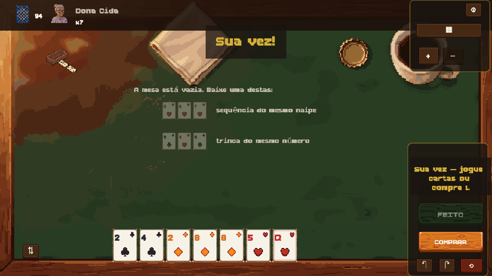

# MEXEMEXE! documentation

*Arruma. Desarruma. Bate.*

A pixel-art digital card game based on Brazilian **Mexe-Mexe**, built with Vite +
TypeScript + Phaser. Free, runs in the browser, installable as a PWA, playable
offline against AI opponents.

[▶ Play in your browser](https://mgummich.github.io/mexemexe-game/) ·
[Source on GitHub](https://github.com/mgummich/mexemexe-game)

## The game in one minute

- 2–4 players, 7 cards each, **two 54-card decks = 108 cards, 4 jokers**. No
  discard pile.
- Build **runs** (3+ same suit, consecutive; ace low *or* high, no K-A-2 wrap)
  and **groups/trincas** (3 or 4 of a rank, natural suits never repeated). At
  most **one joker per meld**.
- **MEXE MODE**: on your turn the whole table is yours to break apart, move,
  split and rebuild. Temporary invalid states are fine while you edit.
- **FEITO** confirms, and only unlocks when every meld is valid, you added at
  least one card from your hand, and nothing left the table.
- No play? **COMPRAR** draws one card and ends your turn.
- Empty your hand first to win. If the draw pile runs out, fewest cards wins.

The authoritative ruleset, with worked examples, is [Game rules](GAME_RULES.md).

## Where to go next

### Playing

| Page | What it covers |
| --- | --- |
| [Game rules](GAME_RULES.md) | Source of truth for the implemented rules |
| [Roadmap](ROADMAP.md) | Done, in progress, planned, deferred |
| [Playtest guide](PLAYTEST_GUIDE.md) | Running a playtest session |

### Developing

| Page | What it covers |
| --- | --- |
| [Development](DEVELOPMENT.md) | Setup, scripts, env vars, troubleshooting |
| [Testing](TESTING.md) | Test suites, verification gates, CI |
| [Performance budgets](PERFORMANCE.md) | Budgets, target devices, how to re-measure |
| [Threat model](THREAT_MODEL.md) | Assets, trust boundaries, prioritized threats |
| [Decisions](DECISIONS.md) | Durable decisions, their reasoning, and what was rejected |
| [Architecture](ARCHITECTURE.md) | Module map, data flow, boundaries, where new code goes |
| [Invariants & scenarios](INVARIANTS.md) | What must always hold, and the scenarios that prove it |
| [Contributing](CONTRIBUTING.md) | Branches, commits, review expectations |

### Features

| Page | What it covers |
| --- | --- |
| [Multiplayer](MULTIPLAYER.md) | Online protocol, server authority, alpha limits |
| [PWA & offline](PWA_OFFLINE.md) | What works offline, service worker, updates |
| [Assets](ASSETS.md) | Every generated asset, its path, how to replace it |
| [Art direction](ART_DIRECTION.md) · [Audio direction](AUDIO_DIRECTION.md) | Visual and audio style guides |

### Running a server

| Page | What it covers |
| --- | --- |
| [Self-hosting](SELF_HOSTING.md) | Deploying the game and the room server |
| [Operations](OPERATIONS.md) | Day-to-day running, upgrades, incidents |
| [Observability & privacy](OBSERVABILITY_PRIVACY.md) | What is monitored, what is never collected |

## Status

Playable and released — see the [changelog](CHANGELOG.md) for the current
version. Local play against AI opponents, the tutorial, cosmetics and offline
play are finished. **Online rooms are alpha**, labelled `ONLINE (ALPHA)` in the
game, with the limitations listed in [Multiplayer](MULTIPLAYER.md).
